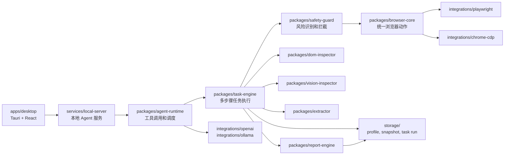

# 架构说明

## 架构目标

- 把桌面交互、本地服务、任务调度、浏览器控制和模型适配分层。
- 让 Playwright、Chrome CDP、OpenAI 和 Ollama 都通过适配层接入，避免侵入任务核心。
- 让安全守卫在高风险动作之前执行，而不是在任务结束后补救。
- 让任务运行数据可重放、可审计、可生成报告。

## 运行链路

## 模块职责

| 模块 | 职责 |
| --- | --- |
| `apps/desktop` | 任务输入、运行状态、会话选择、截图查看、报告查看和安全确认交互。 |
| `services/local-server` | 本地 API、任务生命周期、事件推送、存储访问和桌面端桥接。 |
| `packages/browser-core` | 统一浏览器动作模型、页面句柄、元素定位抽象和动作结果。 |
| `packages/agent-runtime` | Agent 循环、工具注册、模型请求、预算控制和中断处理。 |
| `packages/task-engine` | 任务规划、步骤执行、重试、校验、分支和失败收敛。 |
| `packages/dom-inspector` | DOM、Accessibility Tree、可交互元素和语义摘要分析。 |
| `packages/vision-inspector` | 截图理解接口和后续视觉模型接入点。 |
| `packages/recorder` | 用户动作捕获、步骤规范化和录制元数据。 |
| `packages/player` | 流程回放、参数注入、等待条件和运行结果映射。 |
| `packages/extractor` | 页面内容抽取、字段清洗和结构化输出。 |
| `packages/safety-guard` | 风险分类、策略判定、确认门槛和敏感字段保护。 |
| `packages/report-engine` | 任务摘要、步骤证据、截图引用、失败原因和导出格式。 |
| `integrations/*` | 浏览器驱动、模型提供方和验收场景扩展适配。 |

## 依赖方向

1. `apps` 依赖 `services` 暴露的本地接口，不直接控制浏览器。
2. `services` 组合 `packages` 和 `integrations`，负责把运行态能力暴露给桌面端。
3. `task-engine` 依赖抽象动作和检查结果，不绑定某个浏览器驱动。
4. `browser-core` 依赖浏览器适配接口，不依赖模型提供方。
5. `safety-guard` 位于执行链路前置位置，高风险动作必须先过策略判定。

## 关键数据

| 数据 | 建议内容 |
| --- | --- |
| Task | 用户目标、输入参数、权限上下文、执行预算。 |
| Step | 动作类型、目标元素、前置条件、执行结果、重试信息。 |
| Snapshot | 截图、DOM 摘要、Accessibility Tree 摘要、URL 和时间戳。 |
| Task Run | 任务输入、步骤日志、提取结果、风险决策、报告引用。 |
| Profile | 浏览器用户数据、cookie、会话隔离配置和失效状态。 |

## 存储分区

- `storage/sqlite`：本地索引、任务元数据、流程定义和报告索引。
- `storage/profiles`：浏览器 profile、cookie 和登录态数据。
- `storage/snapshots`：截图、DOM 和页面快照。
- `storage/task-runs`：每次任务执行的日志、步骤证据和导出结果。

## 首版技术切面

- Playwright 先承担页面控制和本地项目验收。
- Chrome CDP 适配层保留给更贴近现有 Chrome 会话、调试和扩展场景的能力。
- DOM 和 Accessibility Tree 是首版页面理解主路径。
- 视觉理解先定义接口和证据存档，再接入模型能力。
