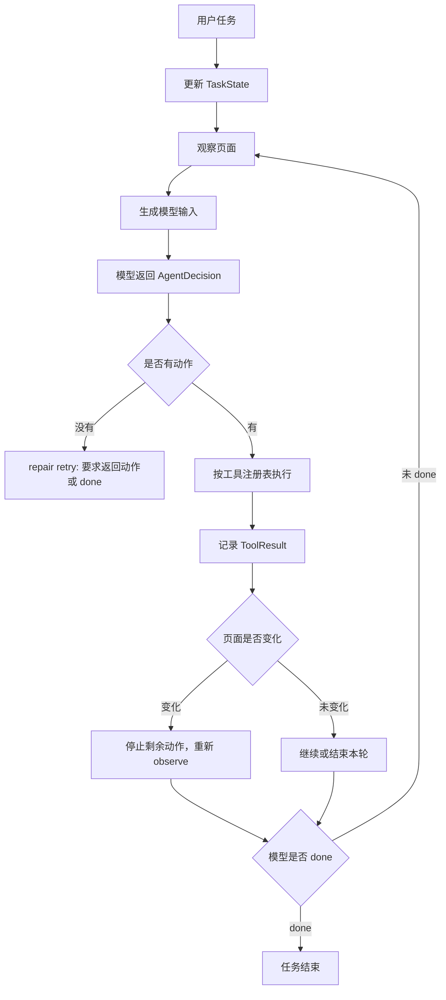

# browser-use 学习笔记与 BrowserPilot 重构建议

本文基于本地源码 `D:\yuCheng-ai\browser-use` 的阅读整理，目标不是照搬它的 Python 实现，而是把其中已经被验证过的浏览器 Agent 工程原则转成 BrowserPilot 后续可落地的设计。

## 阅读范围

重点看了这些模块和测试：

- `browser_use/agent`：Agent 主循环、状态、历史、规划、失败处理、循环检测。
- `browser_use/tools`：工具注册表、动作 schema、动作执行、敏感数据注入。
- `browser_use/browser`：BrowserSession、CDP 会话、事件总线、watchdog、DOM 与截图状态。
- `browser_use/dom`：面向 LLM 的 DOM 序列化、selector map、元素稳定标识。
- `tests/ci`：多动作防护、CDP 超时、循环检测、fallback LLM、结构化提取、敏感数据等回归测试。

## 核心结论

browser-use 做得好的地方不是某个站点规则，而是把 Agent 拆成了几条稳定的通用契约：

1. 模型必须返回结构化决策，不允许只说一句“下一步应该找评论框”却没有动作。
2. 浏览器动作全部通过工具注册表暴露，模型只选择能力，不直接碰浏览器实现。
3. 每一步都有明确状态：上一步是否成功、当前记忆、下一目标、动作列表、done 判断。
4. 动作执行不是裸调用，外面有超时、页面变化保护、失败计数、历史记录和循环提醒。
5. 观察不是把所有 HTML 塞给模型，而是把当前页面状态压缩成可行动的表示，并允许按需补充截图、DOM、提取结果。

这几条和 BrowserPilot 的方向一致：代码负责提供通用能力和安全边界，是否点击评论、是否发评论、任务是否完成，都应该由模型基于状态推理，而不是写死到某个网站。

## browser-use 的关键设计

### 1. Agent 输出契约

browser-use 的模型输出不是自由文本，而是类似这样的结构：

```ts
type AgentDecision = {
  thinking?: string;
  evaluation_previous_goal: string;
  memory: string;
  next_goal: string;
  action: BrowserAction[];
};
```

几个关键点：

- `action` 至少一项。
- `done` 也是一种动作，而且只能单独出现。
- 上一步评估、长期记忆、下一步目标和动作绑在一起。
- 如果模型只返回解释，没有动作，系统会把它当成失败，而不是默默停止。

这能解决我们现在遇到的一个典型问题：模型说“已进入笔记页面，现在需要找到评论输入框”，但没有返回 `click`、`scroll`、`type` 或 `wait`，结果执行器无事可做。

### 2. 工具注册表

browser-use 的工具不是散落在 Agent 里，而是通过 registry 注册：

- 每个动作有名称、参数 schema、描述、是否会终止当前动作序列。
- 当前页面可以动态过滤工具，例如某些动作只在特定 domain 可用。
- 工具执行时注入 `browser_session`、`page_url`、`cdp_client`、`file_system` 等上下文。
- 敏感数据通过占位符和域名范围替换，不把真实值直接暴露给模型。

对 BrowserPilot 的启发：我们现在要继续坚持“通用能力，不写站点规则”，那动作能力应该全部集中到统一工具注册层。模型看见的是能力和参数，不应该知道底层是 Tauri WebView、CDP 还是 Playwright。

建议 BrowserPilot 建立统一动作表：

```ts
type ToolDefinition<TParams> = {
  name: string;
  description: string;
  schema: unknown;
  terminatesSequence?: boolean;
  risk?: "safe" | "confirm" | "blocked";
  execute(params: TParams, context: ToolContext): Promise<ToolResult>;
};
```

### 3. BrowserSession 与事件化执行

browser-use 的 BrowserSession 不是简单的一组函数，它维护：

- 当前 tab、当前 target、CDP session。
- 缓存的 `BrowserStateSummary` 和 `selector_map`。
- 事件总线。
- watchdog：DOM、截图、下载、弹窗、权限、存储状态、安全策略等。
- CDP request timeout，防止底层 WebSocket 还连着但请求永远不返回。

BrowserPilot 现在已经有 Tauri WebView + CDP/Playwright 的基础，但需要把“浏览器能力”抽象成一个 session，而不是让 `server.mjs` 直接拼各类实现细节。

建议抽象：

```ts
type BrowserSessionDriver = {
  open(url: string): Promise<ToolResult>;
  click(targetId: string): Promise<ToolResult>;
  clickAt(point: Point): Promise<ToolResult>;
  type(targetId: string, text: string, options?: TypeOptions): Promise<ToolResult>;
  scroll(options: ScrollOptions): Promise<ToolResult>;
  wait(ms: number): Promise<ToolResult>;
  observe(options: ObserveOptions): Promise<PageObservation>;
  getCurrentUrl(): Promise<string>;
};
```

Tauri WebView、CDP、Playwright 都实现这个接口。Agent 不关心具体驱动。

### 4. 多动作执行与页面变化保护

browser-use 允许模型一步返回多个动作，但执行器有保护：

- `navigate`、`search`、`go_back`、`switch` 等动作标记为 `terminates_sequence`。
- 如果某个动作后 URL 或焦点 target 变化，后续动作停止执行。
- `done` 只能作为单动作出现。
- 动作之间有短等待。

这比“每次只做一个动作”效率更高，但不会在页面变化后继续用旧 selector 乱点。

对 BrowserPilot 的建议：

- 第一阶段最多允许 2 个动作，例如 `type` + `click send`。
- 页面变化后必须重新 observe。
- `open`、`goBack`、`reload`、`evaluate`、可能导航的点击，应终止当前动作序列。
- 对动态网页，默认仍偏保守：点开内容、弹出输入框、提交评论后都重新观察。

### 5. ActionResult 语义

browser-use 的动作结果不只是字符串，而是结构化结果：

```ts
type ToolResult = {
  ok: boolean;
  error?: string;
  isDone?: boolean;
  success?: boolean;
  extractedContent?: string;
  longTermMemory?: string;
  metadata?: Record<string, unknown>;
};
```

这点很关键。Agent 不是只需要知道“点了 a”，而是要知道：

- 这个动作有没有错误。
- 是否导致页面跳转。
- 是否出现新输入框。
- 是否完成任务。
- 是否有需要进入长期记忆的信息。

BrowserPilot 应该把每次工具执行结果都变成下一步模型输入的一部分，而不是只展示给 UI。

### 6. 观察系统

browser-use 的 `BrowserStateSummary` 包含：

- URL、标题、tab 列表。
- 面向 LLM 的 DOM 表示。
- `selector_map`：可交互元素索引到 DOM 节点。
- screenshot，可配置是否送给模型。
- 页面信息：viewport、滚动位置、上下是否还有内容。
- pending network requests、分页按钮、弹窗关闭信息等。

它并没有做“完整 DOM diff”，而是把当前页序列化成 LLM 可读状态，并限制长度。我们已经实现的“增量观察 / diff 观察”方向更适合 BrowserPilot，但要继续强化为“任务相关状态检索”，而不是机械 diff。

建议 BrowserPilot 的观察分层：

```ts
type ObservationKind = "intent" | "full" | "patch" | "focused" | "evidence";

type PageObservation = {
  kind: ObservationKind;
  url: string;
  title: string;
  summary: string;
  activeElement?: TargetRef;
  blocks: ContentBlock[];
  targets: InteractionTarget[];
  inputs: InputTarget[];
  changes?: TaskStatePatch;
  recommendedNext?: ActionCandidate[];
  pageInfo?: {
    viewport: Rect;
    scroll: { x: number; y: number; below: number; above: number };
  };
};
```

其中 `recommendedNext` 不是写业务规则，而是观察系统给出的通用候选，例如“新出现的可编辑输入框”“新出现的发送按钮”“当前 activeElement 是输入框”。最后选择仍交给模型。

### 7. 失败、循环和停止

browser-use 对失败和循环有明确机制：

- 连续失败计数，到阈值停止或请求最终回复。
- LLM 调用、Agent step、CDP request、动作执行都有超时。
- fallback LLM 只在可恢复错误上切换，例如 401、402、429、5xx。
- 循环检测不是写死任务结束，而是给模型加 nudge：你可能在重复相同行为，请换策略。
- 页面指纹用 URL、DOM 文本 hash、元素数量判断是否停滞。

这直接对应我们之前看到的“评论成功后反复评论”问题。正确做法不是代码判断“小红书评论成功了”，而是：

- 工具结果告诉模型“发送按钮已点击，输入框清空/评论列表变化/页面出现新状态”。
- 任务状态告诉模型“用户目标：发表一个评论；已完成动作：输入评论、点击发送”。
- 循环检测发现同一输入动作重复后提醒模型重新评估是否完成。
- 最终由模型返回 `done`。

### 8. 测试体系

browser-use 的测试给了几个很实用的方向：

- 多动作 guard：导航后不能继续执行旧 selector 动作。
- CDP timeout：底层协议静默时必须快速失败。
- 循环检测：相似搜索、相同点击、页面停滞要有 nudge。
- fallback LLM：哪些错误可切模型，哪些错误不切。
- 结构化提取：schema 到输出模型要有单测。
- 敏感数据：占位符替换和域名限制要有单测。

BrowserPilot 需要尽快补这类“Agent 行为测试”，否则每次 UI 或 prompt 改动都容易把上一版成功的链路打坏。

## 对 BrowserPilot 的重构建议

### 目标原则

1. 代码只提供通用能力、状态和安全边界，不写某个网站的业务判断。
2. 模型负责理解用户目标、判断当前页面、选择动作、判断完成。
3. 观察系统负责把页面压缩成可行动信息，不把全量 HTML 原样塞给模型。
4. 执行器负责可靠性：超时、重试、页面变化保护、日志、审计。
5. UI 只展示对话、轨迹、状态和设置，不承载 Agent 核心逻辑。

### 建议模块边界

```text
services/local-server
  只负责本地 API、SSE、配置读取、任务会话生命周期。

packages/agent-runtime
  Agent loop、AgentState、AgentDecision schema、模型调用、repair retry。

packages/tool-registry
  通用工具注册、schema、权限、风险等级、执行结果。

packages/browser-core
  BrowserSessionDriver 抽象和 action result 标准。

packages/dom-inspector
  full / patch / focused observation，selector map，target ranking。

packages/task-engine
  多步任务状态、历史、循环检测、失败策略、done 协议。

integrations/playwright
integrations/chrome-cdp
apps/desktop/src-tauri
  只做驱动适配，不承载 Agent 推理。
```

### 推荐的 Agent Step 流程



### 模型输入结构

建议不要每步都发完整 page JSON，而是分三块：

1. `task_state`：用户目标、已完成里程碑、上一步结果、失败次数、循环提醒。
2. `observation`：当前页面压缩状态，优先 patch/focused。
3. `available_tools`：当前可调用的通用工具 schema。

示例：

```json
{
  "task_state": {
    "goal": "去小红书，找个内容发表个评论",
    "progress": ["opened_xiaohongshu", "opened_content", "typed_comment"],
    "last_result": "clicked send button",
    "loop_warning": null
  },
  "observation": {
    "kind": "patch",
    "url": "https://www.xiaohongshu.com/explore/...",
    "changes": {
      "activeElementChanged": true,
      "newEditableInputs": [],
      "newButtons": ["发送"],
      "semanticRegionsChanged": ["comment_area"]
    }
  },
  "available_tools": ["open", "click", "type", "scroll", "wait", "done"]
}
```

这不是小红书专用。`comment_area` 也可以换成更抽象的 `discussion_region`、`form_region`、`feed_region`，由观察算法根据文本、角色、可编辑元素和布局推断。

### 观察系统下一步升级

当前已经有 full snapshot 和 incremental patch，可以继续升级成四种观察模式：

- `intent`：用户刚发任务时，只用 URL/标题/少量页面摘要，判断是否需要先打开目标网站。
- `full`：首次进入新页面、URL 大变、patch 不可信时使用。
- `patch`：动作后默认使用，只报告任务相关变化。
- `focused`：模型说“找评论框/找发送按钮/找第一个内容”时，观察系统返回候选目标集合，而不是发全页。

关键是增加一个通用 target ranking：

```ts
type TargetRankSignal = {
  visible: boolean;
  enabled: boolean;
  editable: boolean;
  roleMatchScore: number;
  textMatchScore: number;
  layoutPriority: number;
  changedRecently: boolean;
  nearActiveElement: boolean;
};
```

模型提出意图，观察系统做检索和排序，模型再决定点哪个。这样不会变成站点硬编码。

### 任务状态和 done 协议

建议 `TaskState` 显式记录模型自己确认的阶段，而不是代码帮它判断业务完成：

```ts
type TaskState = {
  userGoal: string;
  currentGoal: string;
  memory: string[];
  milestones: Array<{
    name: string;
    status: "pending" | "done" | "blocked";
    evidence?: string;
  }>;
  lastActions: BrowserActionRecord[];
  consecutiveFailures: number;
  loopSignals: string[];
};
```

`done` 也必须是模型动作：

```ts
type DoneAction = {
  type: "done";
  success: boolean;
  message: string;
  evidence?: string;
};
```

代码可以检查结构合法性，但不应该用“小红书 + 发送按钮”这种条件替模型做完成判断。

## BrowserPilot 可执行路线

### Phase 1：统一动作结果和工具注册

- 把当前分散的 `open/click/type/scroll/wait` 封装到 `ToolRegistry`。
- 每个工具返回统一 `ToolResult`。
- 所有工具带 `terminatesSequence`、`risk`、`timeoutMs`。
- UI 轨迹展示 `reason/action/result/diagnostics`，同时这些结果进入下一步模型输入。

### Phase 2：AgentDecision 强 schema

- 要求模型必须返回 `evaluation_previous_goal/memory/next_goal/actions`。
- 没有动作时走 repair retry，要求返回具体动作或 `done`。
- `done` 必须由模型返回，且作为单独动作。
- 保留模型思考摘要给 UI 展示，但不依赖自由文本执行。

### Phase 3：多动作与页面变化保护

- 允许最多 2 个动作。
- 页面 URL、target、activeElement 明显变化后停止后续动作，重新观察。
- 导航类动作标记为终止序列。
- 对动态站点默认更保守，避免旧 target 复用。

### Phase 4：观察检索化

- 保留 full snapshot 作为基线。
- 默认动作后给 patch。
- 增加 focused observation：按模型当前目标检索候选 target。
- 增加 token budget：超预算时降级为候选列表，而不是直接发大 JSON。
- 截图改成 on-demand evidence，而不是每步都送模型。

### Phase 5：可靠性和回归测试

- 加 Agent 行为测试页面：搜索页、内容流、弹窗表单、评论框延迟渲染、发送按钮后出现成功状态。
- 加 CDP/Playwright timeout 测试。
- 加循环检测测试。
- 加“模型返回无动作”的 repair 测试。
- 加敏感动作确认测试：支付、删除、提交、发布。

## 不建议直接照搬的部分

- 不建议直接把 browser-use Python runtime 嵌入 BrowserPilot。我们是 Tauri + React + 本地服务，核心价值是客户端体验和本地浏览器控制。
- 不建议长期依赖全量 DOM 文本。它能跑通 demo，但对大页面、社交网站、后台系统都会很快撞 token 和噪声问题。
- 不建议用站点专用 selector 解决当前问题。短期看快，长期会破坏“浏览器通用 Agent”的定位。
- 不建议把截图作为唯一观察源。图片能补 DOM 的盲区，但评论框、按钮、输入状态、activeElement、可编辑性这些仍然应该优先来自 DOM/AX/CDP。

## 对当前 BrowserPilot 的直接启发

1. 现在最该补的是 `AgentDecision` 强 schema 和 `ToolResult`，这会直接减少“模型说了但没动作”的情况。
2. 增量观察方向是对的，但应该加 focused retrieval，让模型先说目标，观察系统再给候选。
3. 评论成功后反复评论，本质是任务状态和 done 协议不够硬，不是需要写小红书规则。
4. DeepSeek 超时和无动作要进入同一套诊断：模型、请求大小、预算、耗时、返回原文、repair 次数。
5. 浏览器操作 JS 要继续集中封装，但上层还需要 `BrowserSessionDriver`，否则本地 WebView、CDP、Playwright 会继续互相污染。

## 下一步建议

我建议下一轮重构从这三个文件级目标开始：

1. 新增 `packages/agent-runtime` 的 `AgentDecision`、`AgentState`、`ToolResult` 类型。
2. 把 `services/local-server/src/deepseek-agent.mjs` 中的模型响应解析改成强 schema + repair retry。
3. 把现有浏览器动作迁入一个工具注册表，先不改变行为，只改变边界。

这三步做完后，再做 focused observation 和多动作 guard，风险会小很多。
